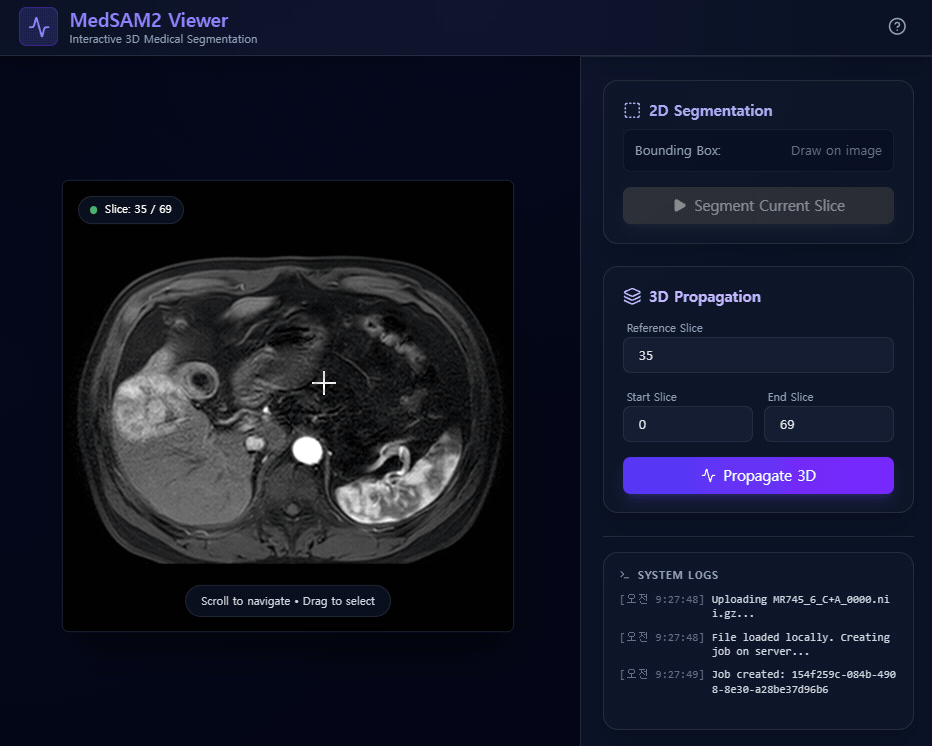
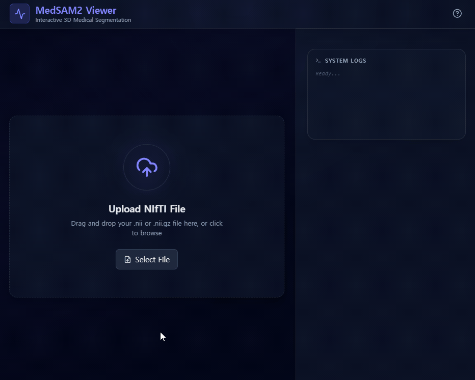
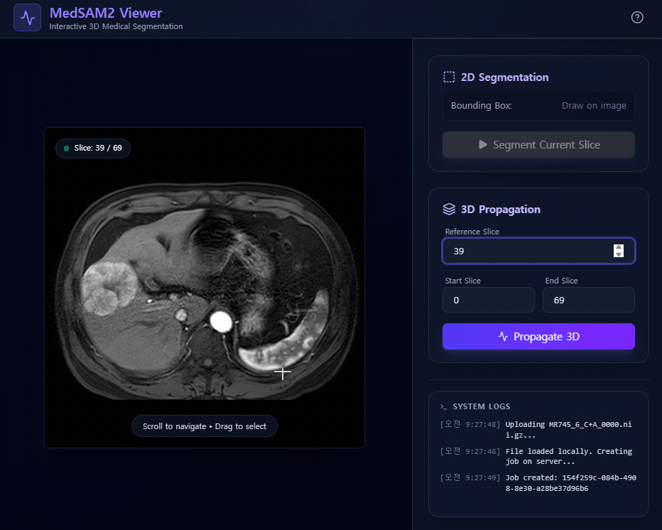
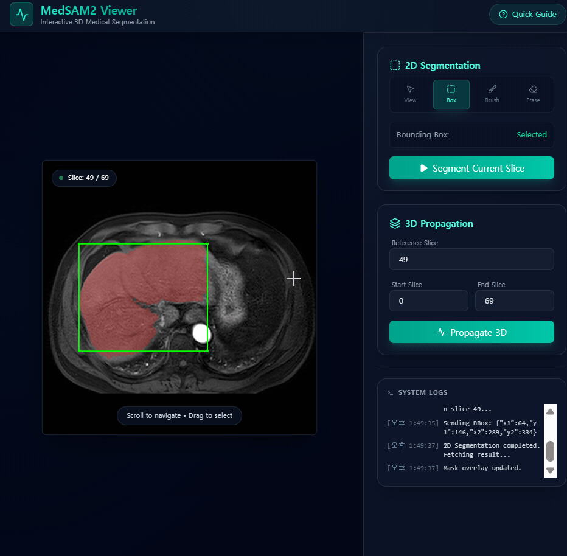
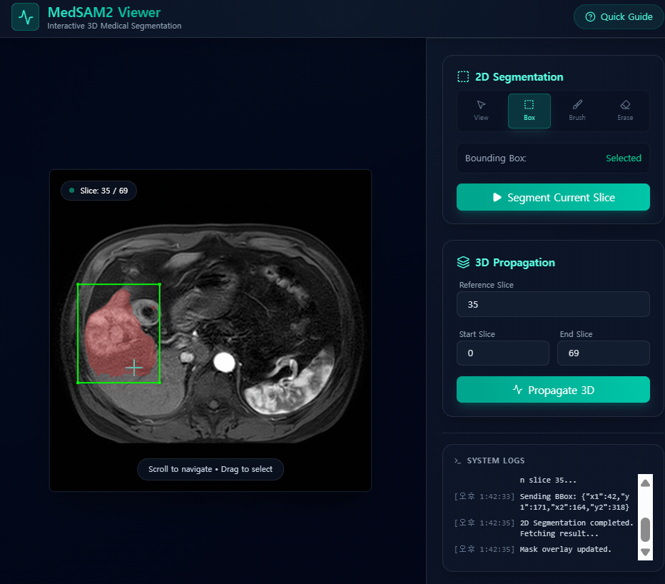

# MedSAM JS 프론트엔드 (MedSAM JS Frontend)

이 프로젝트는 임시 Gradio 뷰어를 대체하기 위해 설계된 새로운 React 기반의 MedSAM 프론트엔드입니다. 3D 의료 이미지 분할(Segmentation)을 위한 더 반응성이 뛰어나고 사용자 친화적인 인터페이스를 제공합니다.

## 주요 기능

  - **대화형 슬라이스 뷰어**: 마우스 휠을 사용하여 NIfTI 슬라이스를 탐색할 수 있습니다.
  - **캔버스 기반 그리기**: 2D 분할을 위해 이미지 위에 직접 바운딩 박스(Bounding box)를 그릴 수 있습니다.
  - **실시간 피드백**: 이미지 위에 오버레이 된 분할 결과를 즉시 확인할 수 있습니다.
  - **3D 전파(Propagation)**: 3D 전파 작업을 손쉽게 설정하고 실행할 수 있습니다.
  - **상태 로깅**: 상세한 시스템 로그를 통해 작업의 진행 상황을 모니터링할 수 있습니다.
  - **최신 UI/UX**:
      - **Teal(청록색) 테마**: 눈이 편안하고 세련된 Teal 기반의 커스텀 컬러 팔레트를 적용했습니다.
      - **글래스모피즘(Glassmorphism) 디자인**: 반투명 패널이 적용된 세련된 다크 테마 인터페이스입니다.
      - **반응형 레이아웃**: 플로팅 컨트롤 패널이 포함된 전체 화면 뷰어를 제공합니다.
      - **도움말 모달**: 신규 사용자를 위한 퀵 가이드가 내장되어 있습니다.
  - **고성능 API 연동**:
      - **안정적인 다중 사용자 지원**: 큐 기반 부하 제어로 여러 사용자가 동시에 접속해도 서버가 멈추지 않습니다.
      - **빠른 응답 속도**: 워커 효율성 개선으로 모델 로딩 시간을 획기적으로 단축했습니다.



## 사전 요구 사항

  - Node.js (v18 이상)
  - npm

## 시작하기

1.  **백엔드 API 시작**:
    MedSAM API 서버가 실행 중인지 확인하십시오.

    ```bash
    ./start_server.sh
    ```

2.  **프론트엔드 시작**:
    시작 스크립트를 실행합니다:

    ```bash
    ./scripts/start_js_frontend.sh
    ```

    또는 수동으로 실행할 수 있습니다:

    ```bash
    cd medsam_js_viewer
    npm install
    npm run dev
    ```

3.  **앱 접속**:
    브라우저를 열고 `http://localhost:5173`으로 이동합니다.

## 사용법

1.  **이미지 업로드**
    - `.nii.gz` 파일을 업로드 영역으로 드래그 앤 드롭합니다.

    

2.  **슬라이스 탐색**
    - 마우스 휠을 사용하여 슬라이스를 스크롤합니다.

3.  **2D 분할 (Segment 2D)**
    - 슬라이스에서 관심 있는 객체 주변에 바운딩 박스를 그립니다.
    - 컨트롤 패널에서 "Segment 2D"를 클릭합니다.

    

4.  **마스크 편집 (Edit Mask)**
    - 브러쉬(Brush)와 지우개(Eraser) 도구를 사용하여 마스크를 수정합니다.
    - 3D 전파 전에 마스크를 정교하게 다듬으면 정확도가 향상됩니다.

    | Brush Tool | Eraser Tool |
    | :---: | :---: |
    |  |  |

5.  **3D 전파 (Propagate 3D)**
    - 전파할 시작(Start) 및 종료(End) 슬라이스 범위를 설정합니다.
    - "Propagate 3D"를 클릭하여 작업을 수행하고 결과를 다운로드합니다.

    

## 데모 결과 (Demo Results)

### Case 2


### Case 3


## 기술 스택

  - **React**: UI 라이브러리
  - **Vite**: 빌드 도구
  - **Tailwind CSS**: 스타일링
  - **nifti-reader-js**: NIfTI 파일 파싱
  - **Axios**: API 통신